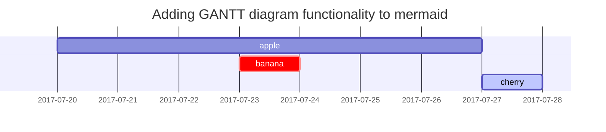

## 제목

<!-- markdownlint-capture -->
<!-- markdownlint-disable -->
# H1 — 제목
{: .mt-4 .mb-0 }

## H2 — 제목
{: data-toc-skip='' .mt-4 .mb-0 }

### H3 — 제목
{: data-toc-skip='' .mt-4 .mb-0 }

#### H4 — 제목
{: data-toc-skip='' .mt-4 }
<!-- markdownlint-restore -->

## 문단

Quisque egestas convallis ipsum, ut sollicitudin risus tincidunt a. Maecenas interdum malesuada egestas. Duis consectetur porta risus, sit amet vulputate urna facilisis ac. Phasellus semper dui non purus ultrices sodales. Aliquam ante lorem, ornare a feugiat ac, finibus nec mauris. Vivamus ut tristique nisi. Sed vel leo vulputate, efficitur risus non, posuere mi. Nullam tincidunt bibendum rutrum. Proin commodo ornare sapien. Vivamus interdum diam sed sapien blandit, sit amet aliquam risus mattis. Nullam arcu turpis, mollis quis laoreet at, placerat id nibh. Suspendisse venenatis eros eros.

## 목록

### 순서 있는 목록

1. 첫째
2. 둘째
3. 셋째

### 순서 없는 목록

- 장
  - 절
    - 문단

### 할 일 목록

- [ ] 작업
  - [x] 1단계
  - [x] 2단계
  - [ ] 3단계

### 설명 목록

태양
: 지구가 그 둘레를 공전하는 항성

달
: 태양빛을 반사해 보이는 지구의 자연 위성

## 인용문

> 이 줄은 _인용문_ 을 보여줍니다.

## 프롬프트

<!-- markdownlint-capture -->
<!-- markdownlint-disable -->
> `tip` 유형 프롬프트의 예시입니다.
{: .prompt-tip }

> `info` 유형 프롬프트의 예시입니다.
{: .prompt-info }

> `warning` 유형 프롬프트의 예시입니다.
{: .prompt-warning }

> `danger` 유형 프롬프트의 예시입니다.
{: .prompt-danger }
<!-- markdownlint-restore -->

## 표

| 회사                         | 담당자           | 국가    |
| :--------------------------- | :--------------- | ------: |
| Alfreds Futterkiste          | Maria Anders     | 독일    |
| Island Trading               | Helen Bennett    | 영국    |
| Magazzini Alimentari Riuniti | Giovanni Rovelli | 이탈리아 |

## 링크

<http://127.0.0.1:4000>

## 각주

고리를 클릭하면 각주[^footnote]로 이동하며, 여기에 또 다른 각주[^fn-nth-2]가 있습니다.

## 인라인 코드

`Inline Code`의 예시입니다.

## 파일 경로

파일 경로는 `/path/to/the/file.extend`{: .filepath} 입니다.

## 코드 블록

### 일반

<!-- markdownlint-disable-next-line MD040 -->
```
구문 강조와 줄 번호가 없는 일반 코드 조각입니다.
```

### 특정 언어

```bash
if [ $? -ne 0 ]; then
  echo "The command was not successful.";
  #do the needful / exit
fi;
```

### 특정 파일명

```sass
@import
  "colors/light-typography",
  "colors/dark-typography";
```
{: file='_sass/jekyll-theme-chirpy.scss'}

## 수식

[**MathJax**](https://www.mathjax.org/)로 표시되는 수식입니다.

$$
\begin{equation}
  \sum_{n=1}^\infty 1/n^2 = \frac{\pi^2}{6}
  \label{eq:series}
\end{equation}
$$

이 수식은 \eqref{eq:series}처럼 참조할 수 있습니다.

$a \ne 0$일 때, $ax^2 + bx + c = 0$의 해는 두 개이며 다음과 같습니다.

$$ x = {-b \pm \sqrt{b^2-4ac} \over 2a} $$

## Mermaid SVG



## 이미지

### 기본 (캡션 포함)

{: width="972" height="589" }
_전체 화면 너비, 가운데 정렬_

### 왼쪽 정렬

{: width="972" height="589" .w-75 .normal}

### 왼쪽으로 띄우기

{: width="972" height="589" .w-50 .left}
Praesent maximus aliquam sapien. Sed vel neque in dolor pulvinar auctor. Maecenas pharetra, sem sit amet interdum posuere, tellus lacus eleifend magna, ac lobortis felis ipsum id sapien. Proin ornare rutrum metus, ac convallis diam volutpat sit amet. Phasellus volutpat, elit sit amet tincidunt mollis, felis mi scelerisque mauris, ut facilisis leo magna accumsan sapien. In rutrum vehicula nisl eget tempor. Nullam maximus ullamcorper libero non maximus. Integer ultricies velit id convallis varius. Praesent eu nisl eu urna finibus ultrices id nec ex. Mauris ac mattis quam. Fusce aliquam est nec sapien bibendum, vitae malesuada ligula condimentum.

### 오른쪽으로 띄우기

{: width="972" height="589" .w-50 .right}
Praesent maximus aliquam sapien. Sed vel neque in dolor pulvinar auctor. Maecenas pharetra, sem sit amet interdum posuere, tellus lacus eleifend magna, ac lobortis felis ipsum id sapien. Proin ornare rutrum metus, ac convallis diam volutpat sit amet. Phasellus volutpat, elit sit amet tincidunt mollis, felis mi scelerisque mauris, ut facilisis leo magna accumsan sapien. In rutrum vehicula nisl eget tempor. Nullam maximus ullamcorper libero non maximus. Integer ultricies velit id convallis varius. Praesent eu nisl eu urna finibus ultrices id nec ex. Mauris ac mattis quam. Fusce aliquam est nec sapien bibendum, vitae malesuada ligula condimentum.

### 다크/라이트 모드와 그림자

아래 이미지는 테마 설정에 따라 다크/라이트 모드로 바뀌며, 그림자가 적용되어 있습니다.

{: .light .w-75 .shadow .rounded-10 w='1212' h='668' }
{: .dark .w-75 .shadow .rounded-10 w='1212' h='668' }

## 동영상



## 역방향 각주

[^footnote]: 각주 출처
[^fn-nth-2]: 두 번째 각주 출처

---
