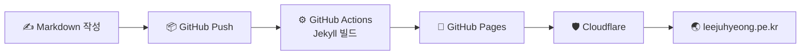

---
# the default layout is 'page'
icon: fas fa-info-circle
order: 4
mermaid: true
---

> 🐙 **쭈꾸미블로그**에 오신 걸 환영합니다!  
> 다리가 여덟 개라 이것저것 다 건드려 보는 개발자의 기록 저장소입니다.
{: .prompt-tip }

## 👋 About Me

안녕하세요, **chosinong**입니다.

웹도 만들고, 그룹웨어도 만들고, 안드로이드 앱도 만들고, 마인크래프트 서버도 열고 플러그인도 만듭니다.
한 우물만 파는 대신 **여덟 개의 다리로 여러 우물을 동시에 파는** 중이에요. 🐙

머리는 하나라 금방 까먹기 때문에, 알게 된 건 **전부** 여기에 적어 둡니다.

| 항목 | 내용 |
| :--- | :--- |
| 🏷️ 닉네임 | chosinong |
| 🌏 블로그 | [leejuhyeong.pe.kr](https://leejuhyeong.pe.kr) |
| 🐙 GitHub | [@LeeJuhyeong424](https://github.com/LeeJuhyeong424) |
| ✉️ Email | <poorruralfarmers@gmail.com> |

## 🦑 8개의 다리로 하는 일

| 다리 | 분야 | 하는 것 |
| :---: | :--- | :--- |
| 🦵 1 | **Web** | Next.js 기반 웹 서비스 개발 |
| 🦵 2 | **Groupware** | 사내용 그룹웨어 시스템 개발 |
| 🦵 3 | **Android** | 안드로이드 앱 개발 |
| 🦵 4 | **Minecraft Plugin** | Spigot / Paper 플러그인 개발 |
| 🦵 5 | **Minecraft Server** | 모드 서버·플러그인 서버 운영 |
| 🦵 6 | **Automation** | Python으로 귀찮은 일 자동화 |
| 🦵 7 | **Infra** | Linux 서버, Docker로 배포·운영 |
| 🦵 8 | **???** | 다음에 꽂힐 무언가 👀 |

## 🛠️ Tech Stack

**Language**

**Framework & Platform**

**Database**

**Infra & Tools**

## 📚 이 블로그에 쌓이는 것

개발 메모·팁
: 자주 쓰는 명령어, 설정 방법, 자꾸 까먹는 문법

트러블슈팅
: 직접 겪은 에러와 삽질, 그리고 결국 해결한 방법

프로젝트 기록
: 웹·그룹웨어·앱을 만들면서 고민하고 배운 것

게임 서버·플러그인
: 마인크래프트 서버 세팅, 모드 구성, 플러그인 개발기

그 밖의 모든 것
: 알게 된 건 일단 전부 기록합니다 📝

> 쭈꾸미는 먹물을 뿜지만, 이 블로그는 **삽질의 흔적**을 남깁니다.  
> 같은 에러로 검색하다 여기 도착하셨다면, 부디 도움이 되길! 🙏
{: .prompt-info }

## 🏗️ Blog Stack

이 블로그는 이렇게 굴러갑니다.

- **Generator** : [Jekyll](https://jekyllrb.com/)
- **Theme** : [Chirpy](https://github.com/cotes2020/jekyll-theme-chirpy)
- **Hosting** : GitHub Pages + GitHub Actions
- **Domain / CDN** : Cloudflare

## 🎯 Goals

- [x] 블로그 개설하기
- [x] 커스텀 도메인 연결하기
- [ ] 꾸준히 글 쓰기 (주 1회 이상)
- [ ] 애드센스 승인받기
- [ ] 댓글 기능 붙이기
- [ ] 여덟 번째 다리 정하기 🐙

---

> 글에 틀린 내용이 있거나 궁금한 점이 있다면 언제든 [이메일](mailto:poorruralfarmers@gmail.com)로 알려 주세요.  
> 쭈꾸미는 피드백을 먹고 자랍니다. 🍜
{: .prompt-warning }
